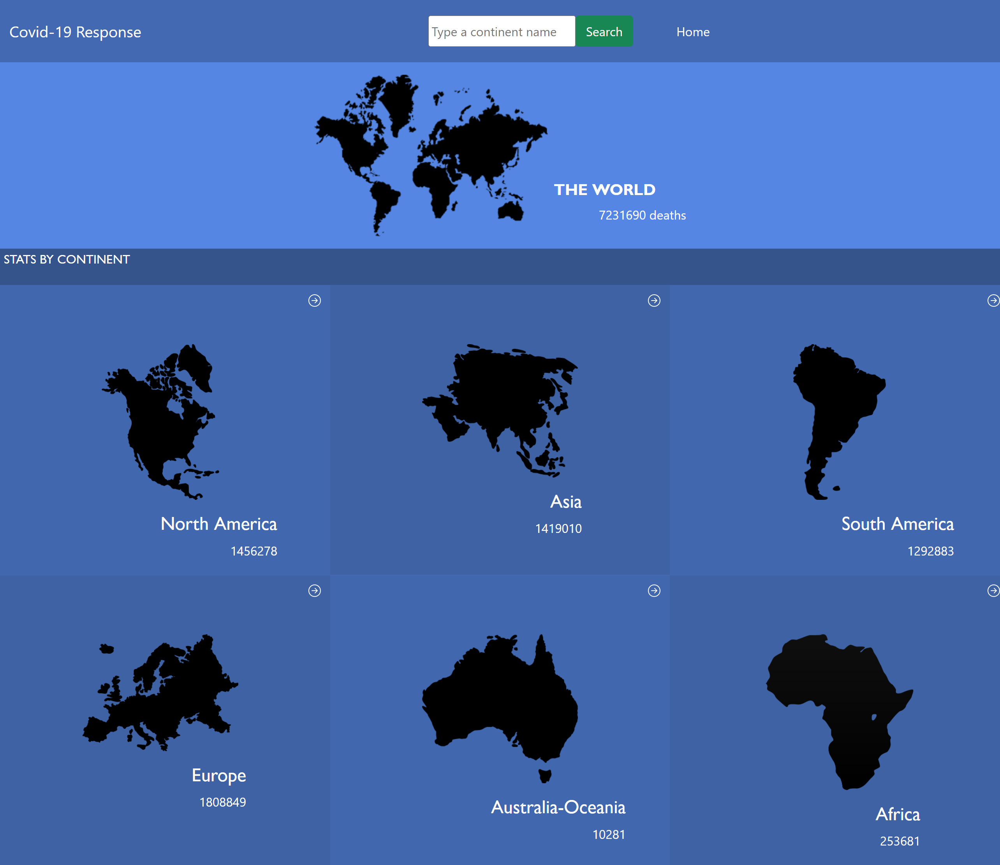
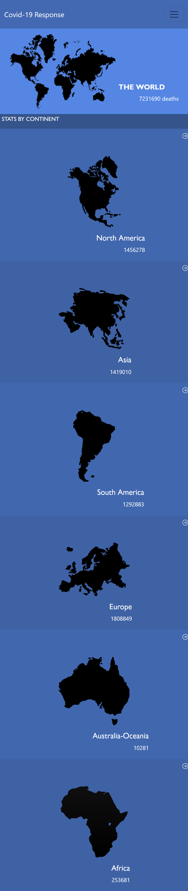

# Covid-19 Metrics

> The Covid-19 Metrics is a site that shows metrics for coronavirus deaths

> |Big Screen       |Small Screen|
> |--------------|--------------|
> |||

> And you can see which countries have the most deaths
## Built With
- ReactJS
- CSS and Bootstrap
- Redux
- Linters

## Live Demo
[Live Demo](https://covid-19-metrics.netlify.app)

### Prerequisites
  - #### Knowledge of these technologies
    - ReactJs
    - Redux
### Setup
  * Open your command
  * Type "git clone https://github.com/basnetlaxmi/covid-19-metrics.git"
  * npm i
  * npm run start
### Run the app
  * npm run start

### Deployment
  * npm run build

## Testing
  * npm run test
## Author

👤 **Laxmi Basnet**

- GitHub: [@basnetlaxmi](https://github.com/basnetlaxmi)
- LinkedIn: [LinkedIn](https://np.linkedin.com/in/laxmi-basnet-b22403131)

## 🤝 Contributing

Contributions, issues, and feature requests are welcome!

Feel free to check the [issues page](../../issues/).

## Show your support

Give a ⭐️ if you like this project!

## Acknowledgments

- Designed by [Nelson Sakwa](https://www.behance.net/gallery/31579789/Ballhead-App-(Free-PSDs))
- Microverse learning partners
- Microverse

## 📝 License

This project is [MIT](./MIT.md) licensed.